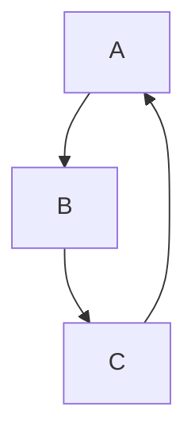

# Firewall Policy Conversion Package 

## Palo Alto to AMD Pensando DSS

Considerations
* The AMD Pensando DSS firewall is L4 while Palo Alto operates up to L7.  
* Palo Alto can use zones in rules, there is no direct translation to the DSS model.
* For zone based, we will initially implement at the VRF-level on the DSS.
* Palo Alto can use object groups that will need to be translated to individual items in the DSS model.
* Do we need to expand or group input entries?

Conversion Algorithm
1. Identify entries that can operate at L4 (not using AppID).
2. Identify entries that have 'any' in both zone source and destination fields.
3. Convert the entries that math 1 and 2.
4. Identify entries that have specified zones in source and/or destination.  
5. Convert the entries that match 1 and 4.
6. Display entries that were not converted.

Implementation Notes
* Using [pango](github.com/PaloAltoNetworks/pango/poli/security) package structs for conversion.
* Currently using CSV exports from Palo Alto. Can look at getting entries directly from Panorama or individual systems.
